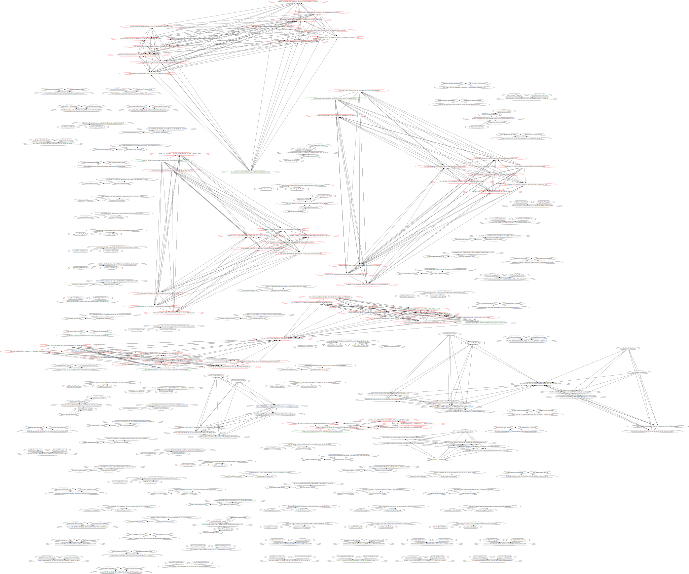
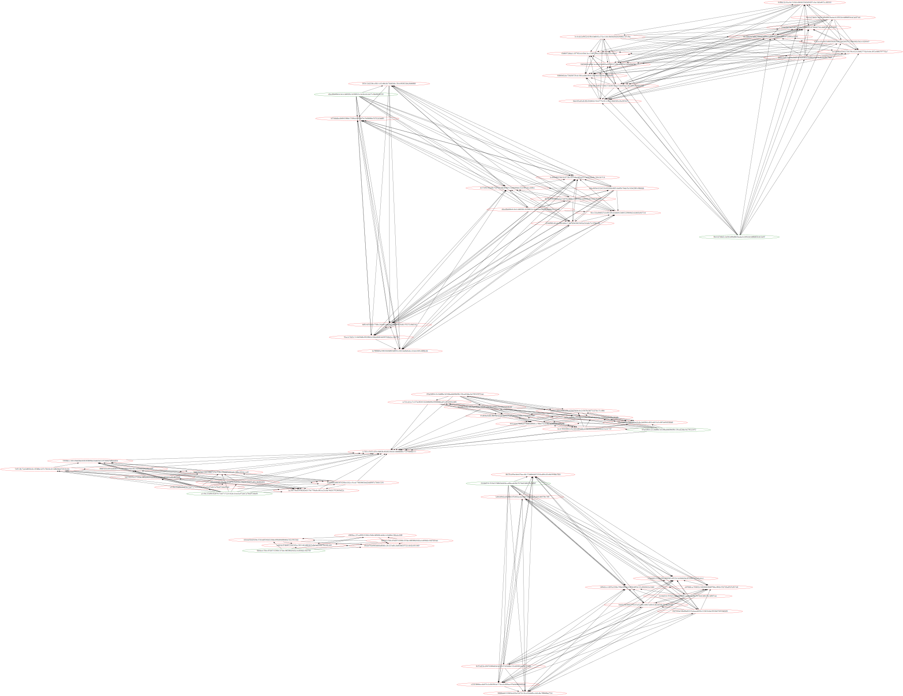

# overlay2map

This project maps the files found in `/var/lib/docker/overlay2`.

Firstly, run

```shell
docker builder prune -af
docker system prune -af
```

The run the executable on the target system which will produce
`overlay2map.svg`.  Red nodes are layer nodes, green nodes are top
level nodes.

The command also outputs a series of shell commands which, if executed,
would delete all the unattached layers.

> Disclaimer: use as your own risk!

## Before



## After


